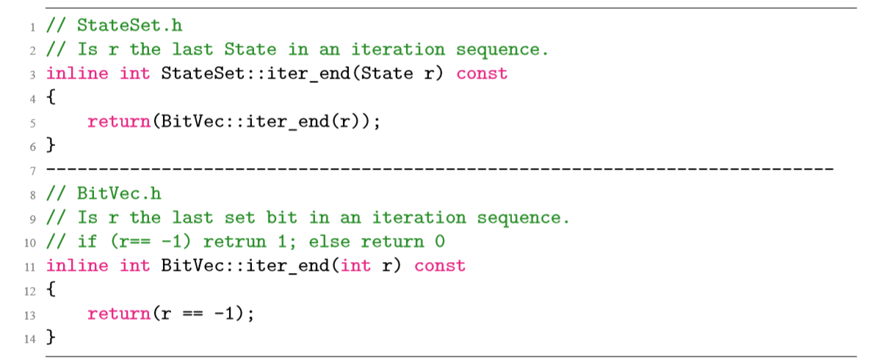

# 前言
在开始之前还是需要说一些必须要说的话：

截至我毕业（2019.06）时，西安电子科技大学（以下称西电）并没有官方承认的 Latex 模板，如果你使用此模板来制作你的论文，则默认你同意自行承担因此模板带来的一切后果!!

下面说一些轻松的，我用这个模板制作的论文也正常提交查重了，如果编译引擎没有巨变或者西电的要求没有太大变化，这个模板应该还是可用的。上面所说毕竟仅仅是为了让你使用模板之前知道现在西电没有严格意义上的本科生Latex模板可用。我从[崔元顺同学](https://github.com/StickCui/XDUthesis-personal)的 repo fork的时候，模板已经与西电（或者说机电工程学院）给的我论文格式要求有所不同了。所以在做了一些修改之后，自认为格式已经符合要求。并且斗胆在睿思上上传了非常简陋的使用方法。

Latex 的上手时间会比较长，特别认同之前看过的一句话。`Word 是所见即所得，Latex 是所写即所得`。个人觉得 Word 更加适合已经定稿之后再来排版，不然对于对word不熟悉的同学来说，有增删的时候有可能会严重破坏排版。我们不对Word和Latex孰优孰劣做判断，它们适合的场景不同。

# 一些可能有疑问的地方

入门级的使用方法可以看睿思的帖子，这里就不再细说了。这里说一些同学们使用过程中可能有疑问。

## 各个参数的意义

### worldOneHalf

在`Demo.tex`的文件开头有这样一条语句 `\documentclass[WordOneHalf,print]{XDUthesis} `，第一个参数`WordOneHalf`的意思时使用与Word的1.5倍行距，这里牵扯到Word和Latex的行距的具体意义，如果你有兴趣了解可以在网络上搜索一下。经过试验，在本模板中，Latex使用 `\setstretch{1.62}`时行距大约与Word的1.5倍行距相当

### print
因为论文要求打印装订时装订边会比较宽，所以同样的生成的PDF文件也要求奇数页左边宽，偶数页右边宽，这样装订之后才是正常的。添加`print`参数时模板输出的PDF将是打印样式的，去掉之后将会输出两边等宽的PDF文件，方便作为电子版文档预览。

### contentsnd
此参数加上之后，生成的PDF文件的目录将不包含点状连接线和缩进，此条是因为学校给的论文示范手册上的目录是不包含连接线的。具体是否要加可以咨询导师或者学院。

## 关于封面

西电默认要求应该是要论文胶装的，封面学校会发，所以模板生成的封面不用太过在意（即使我们已经尽量让封面靠近学校的封面样式了），并且即使封面坏了，打印店也买得到。

## 关于查重

在我毕业(2019.06)时，西单的查重是在一站式网上办事大厅 `[ehall.xidian.edu.cn](http://ehall.xidian.edu.cn/)`的毕业设计模块直接上传PDF文件，虽然没有明说，但是重查重报告来看，2019年西电本科生论文的是用知网查的，两次机会用完之后可以向导师请求再给几次查重机会，不过切忌使用自己的账号帮其他同学查重，查重记录是会跟着你的账号走的。

# 模板的一些进阶使用方法

## 代码格式

西电作为电子信息方面的强校，不得不说理工气息很浓厚，有相当比例的同学的毕设内容是与写程序相关的，我的论文如果要把全部代码附上，代码所占的篇幅将会远远超过正文篇幅。

我没有更改崔元顺学长内置的代码格式。

在我实际提交的论文中，我是这样使用代码格式的。在Demo.tex的 begin{document} 前面加上
```tex
\definecolor{codegreen}{rgb}{0,0.6,0}
\definecolor{codegray}{rgb}{0.5,0.5,0.5}
\definecolor{codepurple}{rgb}{0.58,0,0.82}
\definecolor{backcolour}{rgb}{0.99,0.99,1.0}

\lstdefinestyle{mystyle}{
    backgroundcolor=\color{white},   
    %commentstyle=\color{black},
    commentstyle=\color{XDU@commentcolor},
    keywordstyle=\color{magenta},
    numberstyle=\tiny\color{codegray},
    stringstyle=\color{codepurple},
    %basicstyle=\footnotesize\sffamily,
    basicstyle=\linespread{1}\small\ttfamily,
    breakatwhitespace=false,         
    breaklines=true,                 
    captionpos=b,                    
    keepspaces=true,                 
    numbers=left,                    
    numbersep=5pt,                  
    showspaces=false,                
    showstringspaces=false,
    showtabs=false,                  
    tabsize=4
}
\lstdefinestyle{printstyle}{
    backgroundcolor=\color{white},   
    %commentstyle=\color{black},
    commentstyle=\color{black},
    keywordstyle=\color{black},
    numberstyle=\tiny\color{codegray},
    stringstyle=\color{black},
    %basicstyle=\footnotesize\sffamily,
    basicstyle=\linespread{1}\small\ttfamily,
    breakatwhitespace=false,         
    breaklines=true,                 
    captionpos=b,                    
    keepspaces=true,                 
    numbers=left,                    
    numbersep=5pt,                  
    showspaces=false,                
    showstringspaces=false,
    showtabs=false,                  
    tabsize=4
}

\lstset{style=printstyle}
```
最后一行的 `style=printstyle`将会把全文的代码格式设置为{printstyle}所定义的字体、缩进、颜色等等。电子版预览的时候可以改成`style=mystyle`
电子版预览时我使用的代码样式如下图所示



设置为 printstyle 时将全部为黑色。

## 算法样式

算法样式算是使用Latex的一大理由了，一个比较典型的算法样式如下图所示


然后对应的 latex 源码如下

```text
\begin{algorithm}
    \caption{Hopcroft 最小化算法}\label{al:4-8}
    \small
    \begin{algorithmic}[1]
        \State $P:=[Q]_{E_0}$;
        \State $L:= ( \mbox{\textbf{if }} ( |F| \leq |Q \setminus F | ) \mbox{\textbf{then }} \{F\} \mbox{\textbf{else }} \{ Q \setminus F \} \mbox{\textbf{end if }} ) \times V $;
        \State $\{ \mbox{恒有：} [Q]_E \sqsubseteq P \sqsubseteq [Q]_{E_0} \land L \subseteq (P \times V) $
        \State \quad $ \land (\forall Q_0,Q_1,a:Q_0 \in Q \land (Q_1,a) \in L : \neg Splittable (Q_0,Q_1,a)) \Rightarrow (P=[Q]_E) \} $
        \Repeat {$L \not= \emptyset \longrightarrow$}
            \State $ \mbox{\textbf{let }} Q_1,a:(Q_1,a) \in L $;
            \State $ P_{old} := P $;
            \State $ L := L \setminus \{ (Q_1,a) \} $;
            \State $ \{ \mbox{恒有:} [Q]_E \sqsubseteq P \sqsubseteq P_{old} \} $
            \For {$Q_0 : Q_0 \in P_{old} \land Splittable (Q_0,Q_1,a)$}
                \State $ Q'_0 := \{ p:p \in Q_0 \land T(p,a) \in Q_1 \} $;
                \State $ P:= P \setminus \{ Q_0 \} \cup \{ Q_0 \setminus Q'_0,b \} $;
                \For {$b:b \in V$}
                    \If{$(Q_0,b) \in L$}
                       $ L := L \setminus \{ (Q_0,b) \} \cup \{ (Q'_0,b),(Q_0, \setminus Q'_0,b ) \} $
                    \ElsIf{$(Q_0,b) \not\in L$}
                        \State $L:= L \cup ( \mbox{\textbf{if }} ( |Q'_0| \leq |Q_0 \setminus Q'_0 | ) \mbox{\textbf{then }} \{(Q'_0,b)\} \mbox{\textbf{else }} \{ (Q_0 \setminus Q'_0,b) \} \mbox{\textbf{end if }} ) $;
                    \EndIf
                \EndFor
            \EndFor
            \State $ \{ (\forall Q_0,Q_0 \in P : \neg Splittable(Q_0,Q_1,a)) \} $
        \Until $\{ P = [Q]_E \}$
    \end{algorithmic}
\end{algorithm}
```

个人觉的算法环境算是写起来相当麻烦的内容了。这里最好的学习方式就是多尝试，可以看看官方的文档，会很有帮助的。(暂停一下，之后再补充内容)